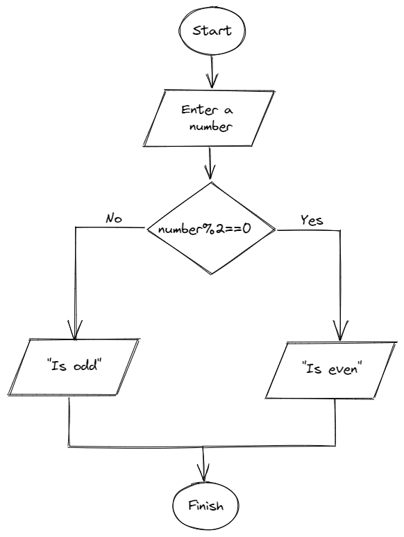

# Statement
---
Design an algorithm to check if a number is even or odd. If it is even, write that it is even, otherwise write that it is odd. Represent the algorithm in a flowchart.

# Solution
---
## Algorithm
```
1. Enter a number
2. Divide the number by 2
3. If the result of the division is 0, the number is even.
4. Else if the result of the division is 1, the number is odd.
```

## Flowchart

<br>