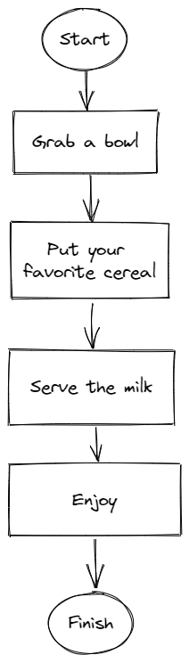

# Statement
---
Create an algorithm to prepare a bowl of cereal with milk. Represent the result in pseudocode and in a flowchart.
# Solution
---
## Algorithm
```
1. Grab a bowl
2. Put your favorite cereal
3. Server the milk
4. Enjoy
5. Finish
```

## Flowchart

<br>