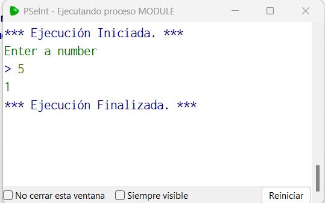
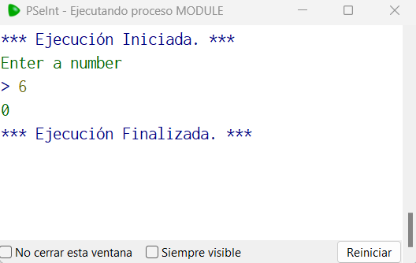

# Statement
---
The challenge for you now is to create a PSeInt program that will receive a number from the user and add the mod operator using the even/odd case ( X % 2 ) where X is the user input

# Solution
---
### Pseudocode

```python
Algoritmo Module
	Imprimir 'Enter a number'
	Leer x
	x <- x%2
	Imprimir x
FinAlgoritmo
```
### Output
<br>

<br>