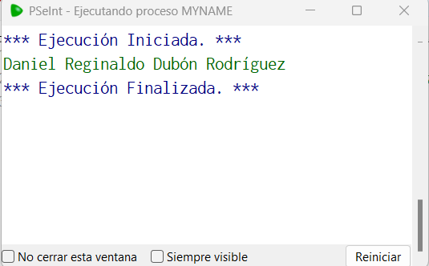

# Statement
---
This will be a guided challenge, the idea is for you to use PSeInt. For this challenge, we will print your name on the screen, a simple task that will help us to review the way PSeInt works.

# Solution
---
### Pseudocode

```python
Algoritmo myName
	Imprimir 'Daniel Reginaldo Dubón Rodríguez'
FinAlgoritmo
```
### Result
<br>