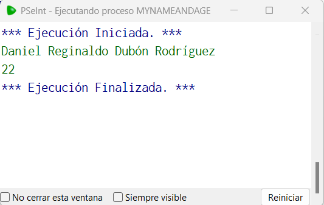

# Statement
---
This challenge is similar to the previous guided challenge, but now you will try alone. For this challenge, you will need to create an algorithm in Pseudocode using PSeInt that prints your name and your age in separate lines, remeber that your name should be a string and your age a number

# Solution
---
### Pseudocode

```python
Algoritmo myNameAndAge
	Imprimir 'Daniel Reginaldo Dubón Rodríguez'
	Imprimir '22'
FinAlgoritmo
```
### Result
<br>