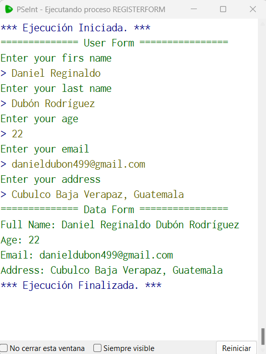

# Statement
---
You are given the task to create a registration form for new users, this form should ask the user for the following information:

First name
Last name
Age
Email
Address
At the end of the program, you should print all the information added from the user in a friendly way


# Solution
---
### Pseudocode
```python
Algoritmo RegisterForm
	Imprimir '============== User Form ================'
	Imprimir 'Enter your firs name'
	Leer firstName
	Imprimir 'Enter your last name'
	Leer lastName
	Imprimir 'Enter your age'
	Leer age
	Imprimir  'Enter your email'
	Leer email
	Imprimir 'Enter your address'
	Leer address
	Imprimir '============== Data Form ================'
	Imprimir 'Full Name: ', firstName,' ', lastName
	Imprimir 'Age: ', age
	Imprimir 'Email: ', email
	Imprimir 'Address: ', address
FinAlgoritmo
```

### Output
<br>