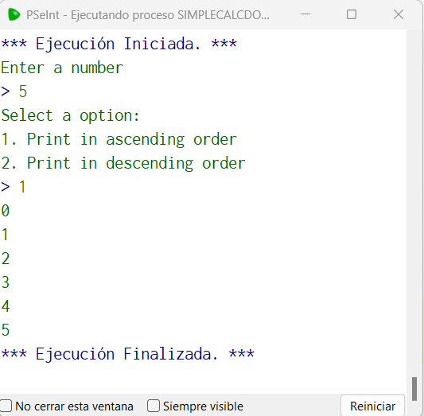
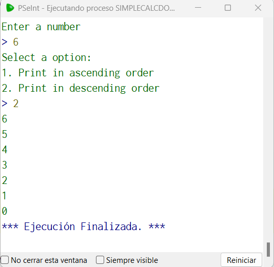

# Statement
---

For this challenge we are going to print numbers in ascending or descending order. The user must enter a number, then he must enter if he wants to print the numbers in ascending or descending order. If the user chooses ascending, the numbers will be printed from the number 0 to the number entered, otherwise the numbers will be printed descending from the number entered to the number 0.To solve this challenge remember to use the For(Para) loop.

# Solution
---
### Pseudocode
```python
Algoritmo acendingDescending
	Imprimir 'Enter a number'
	Leer x
	Imprimir 'Select a option:'
	Imprimir '1. Print in ascending order'
	Imprimir '2. Print in descending order'
	Leer op
	Si op == 1 Entonces
		Para i<-0 Hasta x Hacer
			Imprimir i
		Fin Para
	Fin Si
	Si op == 2 Entonces
		Para i<-x Hasta 0 Hacer
			Imprimir i
		Fin Para
	Fin Si
FinAlgoritmo
```

### Result

<br>

<br>