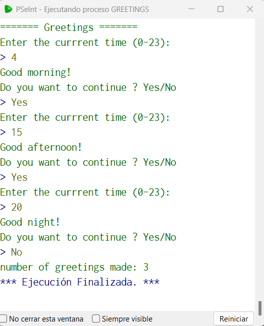

# Statement
---

For this challenge, you need to create a program that prints a greeting based on an hour entered. The program should do the following:

Print Buenos dias! if the hour is from 0 to 12
Print Buenas tardes! if the hour is from 13 to 18
Print Buenas noches! if the hour is from 19 to 23
Ask the user if he wants to perform another greeting. If the answer is Si, the program must start again.
At the end of the program, print out the number of times the program has greeted.

# Solution
---
### Pseudocode
```python
Algoritmo Greetings
	Imprimir '======= Greetings ======='
	cont <- 0
	continue <- 'Yes'
	Mientras continue == 'Yes' Hacer
		Imprimir 'Enter the currrent time (0-23):'
		Leer hr
		Si hr <= 12 Entonces
			Imprimir 'Good morning!'
		SiNo 
			Si hr <= 18 Entonces
				Imprimir 'Good afternoon!'
			SiNo
				Imprimir 'Good night!'
			Fin Si
		Fin Si
		
		cont <- cont + 1
		Imprimir 'Do you want to continue ? Yes/No'
		Leer continue
	Fin Mientras
	Imprimir 'number of greetings made: ', cont
FinAlgoritmo
```

### Result

<br>