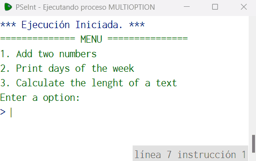

# Statement
---

For this challenge you will create a program with multiple options using **Switch (Segun)**, the options available are the following:

1. Sum two numbers
2. Print the day of the week given the day number
3. Print the length of a given text

This program must have a start menu where the user must select one of the previously described options. When the user selects each of the options, the program will perform the following:

1. Sum. The user enters two numbers and the result of the sum of both is printed
2. Print day of the week. The user enters a day of the week using numbers and the name of the day must be printed. For example, if the number 1 is entered, the program prints the text `Lunes`.
3. Calculate text length. The user enters a text and the length of the text should be printed. I was able to use the Pseint `Longitud` function to get the length.

When the user enters an incorrect option, a message should be printed saying that the option is not available.

# Solution
---
### Pseudocode
```python
Algoritmo multiOption
	Imprimir '============== MENU ==============='
	Imprimir '1. Add two numbers'
	Imprimir '2. Print days of the week'
	Imprimir '3. Calculate the lenght of a text'
	Imprimir 'Enter a option:'
	Leer op
	Segun op Hacer
		1:
			Imprimir ''
			Imprimir '------------ ADD TWO NUMBERS ------------'
			Imprimir 'Enter the first number'
			Leer n1
			Imprimir 'Enter the second number'
			Leer n2
			Imprimir 'Result: ',(n1 + n2)
		2:
			Imprimir ''
			Imprimir '-------- PRINT DAYS OF THE WEEK ----------'
			Imprimir 'Enter the day of the week in numbers (1-7)'
			Leer day
			Segun day Hacer
				1:
					Imprimir 'Monday'
				2:
					Imprimir 'Tuesday'
				3:
					Imprimir 'Wednesday'
				4:
					Imprimir 'Thursday'
				5:
					Imprimir 'Friday'
				6:
					Imprimir 'Saturday'
				7:
					Imprimir 'Sunday'
				De Otro Modo:
					Imprimir 'Wrong day!'
			Fin Segun
		3:
			Imprimir ''
			Imprimir '----- CALCULATE THE LENGHT OF A TEXT ------'
			Imprimir 'Enter a text'
			Leer cad
			Imprimir 'Result: ', Longitud(cad)
		De Otro Modo:
			Imprimir 'Wrong option!'
	Fin Segun
FinAlgoritmo
```

### Result

<br>