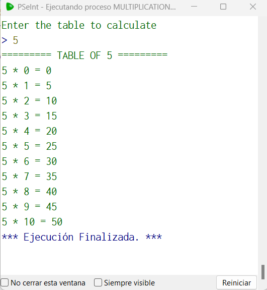

# Statement
---

For this challenge you will create a program to calculate the multiplication tables for a given number using the For(Para) loop. The user must enter a number and then the multiplication table for the number must be printed.

# Solution
---
### Pseudocode
```python
Algoritmo multiplicationTablesWithFor
	Escribir 'Enter the table to calculate'
	Leer x
	Escribir '========= TABLE OF ',x,' ========='
	Para i<-0 Hasta 10 Hacer
		Escribir x, ' * ',i,' = ',(x*i)
	FinPara
FinAlgoritmo
```

### Result

<br>