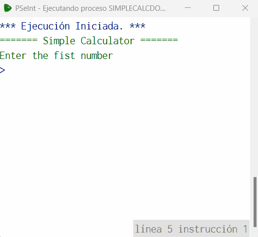

# Statement
---

For this challenge we are going to use the simple calculator that we made in the challenge 02 but now adding the functionality to perform a calculation again without finishing the program. The program should ask us if we want to use another operation and if the user answers yes then we can perform a new operation. To solve this challenge remember to use Do while (Repetir Hasta Que).

# Solution
---
### Pseudocode
```python
Algoritmo simpleCalcDoWhile
	Imprimir '======= Simple Calculator ======='
	Repetir 
		Imprimir 'Enter the fist number'
		Leer n1
		Imprimir 'Enter the second number'
		Leer n2
		Imprimir 'Select a operation: +,-,*,/'
		Leer op
		Si op == '+' | op == '-' | op == '*' | op == '/' Entonces
			Imprimir 'Processing: ', n1, ' ', op,' ', n2
			Segun op Hacer
				'+':
					Imprimir 'Result: ', (n1 + n2)
				'-':
					Imprimir 'Result: ', (n1 - n2)
				'*':
					Imprimir 'Result: ', (n1 * n2)
				'/':
					Imprimir 'Result: ', (n1 / n2)
			Fin Segun
		SiNo
			Imprimir 'Invalid operation'
		FinSi
		
		Imprimir 'Do you want to continue with another operation? Yes / No'
		Leer continue
	Hasta Que continue == 'No' | continue == 'no'
FinAlgoritmo
```

### Result

<br>