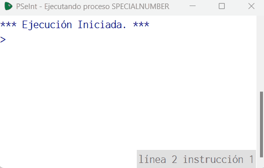

# Statement
---
You must create the code that follows the following logic, if the given number is 100, take this number as special and show the following message: "This is a special number!", but if the number is less than 1000, multiple of 10 and different from 100, you must show the following message: "This number is almost special". if none of the given conditions are met show the following message: "Just a regular number". Another developer was trying to program the logic, but apparently couldn't, you need to fix the code to work properly

This was the code from the developer

```python
Algoritmo specialNumber
	Leer n
	Si n == 100 Entonces
		Imprimir 'This is a special number'
	FinSi
	Si n < 1000 Entonces
		Imprimir ''
	SiNo
		Imprimir 'Just a regular number'
	FinSi
	Si n % 10 == 0 Entonces
		Imprimir 'This number is multiple of 10'
	FinSi
FinAlgoritmo
```

# Solution
---
### Pseudocode
```python
Algoritmo specialNumber
	Leer x
	Si x == 100 Entonces
		Imprimir 'This is a special number'
	SiNo
		Si (x < 1000) & (x % 10 == 0) Entonces
			Imprimir  'This number is almost special'
		SiNo
			Imprimir 'Just a regular number'
		FinSi
	FinSi
FinAlgoritmo
```

### Result

<br>