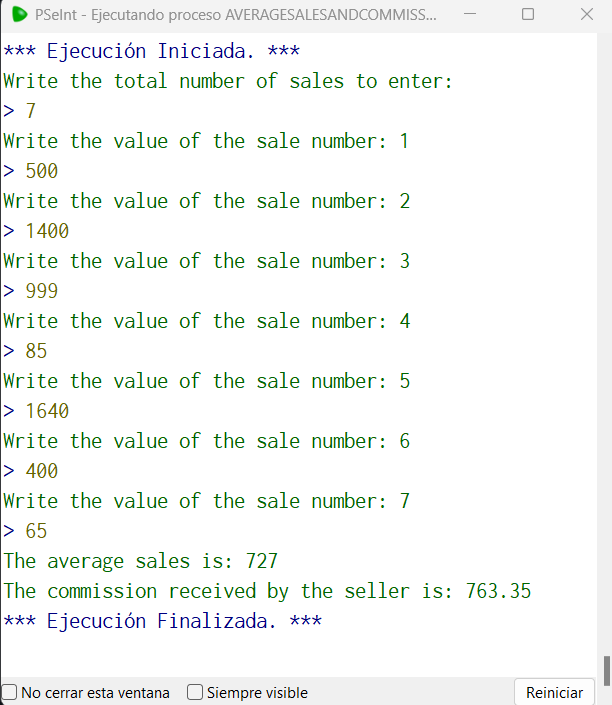

# Statement
---

Make a program that asks how many sales the seller had, Once the number of sales is entered, ask for the value of each sale until all are entered, then return as a result the average value of sales, and the commission that the seller will take, If the seller had more than 5 sales, his commission will be 15% of the total value of the sales, if he sold 5 or less, his commission will be only 10%.

# Solution
---
### Pseudocode
```python
Algoritmo averageSalesAndCommission
	Escribir "Write the total number of sales to enter:"
	Leer cont
	total = 0
	
	Para i = 1 Hasta cont Hacer
		Escribir "Write the value of the sale number: ",i
		Leer amount
		total = total + amount
	FinPara
	
	average = total / amount 
	Imprimir 'The average sales is: ', average
	
	SI cont < 5 Entonces
		Imprimir 'The commission received by the seller is: ', total * 0.10
	SiNo
		Imprimir 'The commission received by the seller is: ', total * 0.15
	FinSi
	
FinAlgoritmo
```

### Result

<br>