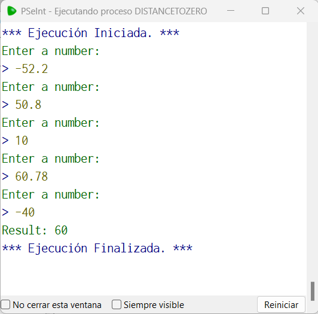

# Statement
---

Make a program that asks for 5 values ​​and also allows us to know which one is furthest from zero, once obtained it returns that number (the numbers can be negative), showing only the integer part of the number.

# Solution
---
### Pseudocode
```python
Algoritmo distanceToZero
	Definir aux Como Entero
	Para i=0 Hasta 4 Hacer
		Escribir 'Enter a number: '
		Leer num
		num = abs(num)
		Si num>aux Entonces
			aux=num
		FinSi
	FinPara
	Escribir 'Result: ', trunc(aux)
FinAlgoritmo
```

### Result

<br>