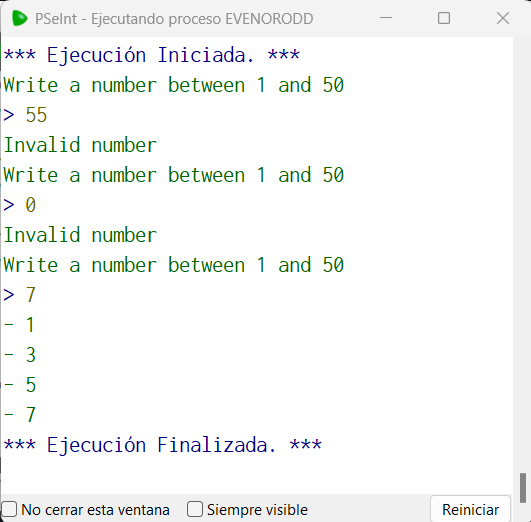

# Statement
---

Request a number from 1 to 50, if the number is not between those values, report the error and request it again until you get a valid number, then it shows on the screen all the numbers from 1 to that number, if the number is even it only shows the even numbers, if it is odd it only shows the odd ones.

# Solution
---
### Pseudocode
```python
Algoritmo Even_Odd
	Repetir
		Escribir "Write a number between 1 and 50"
		leer n
		SI  n < 1  | n > 50 Entonces
			Imprimir 'Invalid number'
		FinSi
	Mientras Que n < 1  | n > 50
	
	even =  n % 2 = 0
	
	Para i=1 Hasta n Hacer
		SI i % 2 = 0 & even Entonces
			Imprimir i
		FinSi
		SI i % 2 = 1 & ~(even) Entonces
			Imprimir '- ', i
		FinSi
	FinPara
FinAlgoritmo
```

### Result

<br>