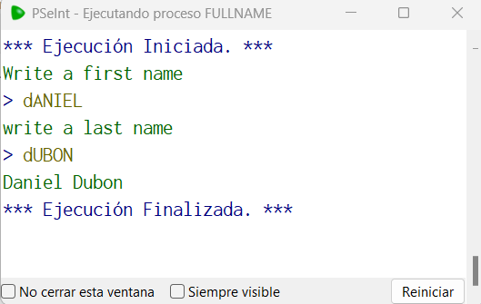

# Statement
---

Make a program that takes a first name and a last name, then returns a string with both values ​​with the first letter uppercase and the rest lowercase.

# Solution
---
### Pseudocode
```python
Algoritmo fullName
	Escribir "Write a first name"
	Leer firstName
	Escribir "Write a last name"
	leer lastName
	firstNameAux = Mayusculas(Subcadena(firstName,0,1)) + Minusculas(Subcadena(firstName,2,Longitud(firstName)))
	lastNameAux = Mayusculas(Subcadena(lastName,0,1)) + Minusculas(Subcadena(lastName,2,Longitud(lastName)))
	Imprimir firstNameAux, " ",lastNameAux
FinAlgoritmo
```

### Result

<br>