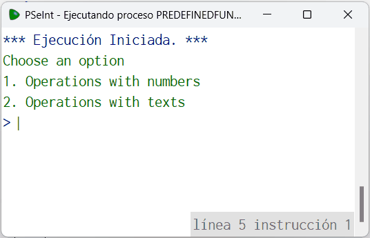

# Statement
---

The predefined functions of pseint, are codes already integrated in the program to be used when the user requires it, normally they are mathematical functions or functions for text strings.

```
  - Predefined functions
    - Maths
        - abs
        - trunc
        - redon
        - azar
    - Chain
        - longitud
        - mayusculas
        - minusculas
        - subcadena
```

# Solution
---
### Pseudocode
```python
Algoritmo PredefinedFunctions
	Escribir 'Choose an option'
	Escribir '1. Operations with numbers'
	Escribir '2. Operations with texts'
	Leer op
	Si op==1 Entonces
		Escribir 'Choose an option'
		Escribir '1. Absolute value of a number'
		Escribir '2. Truncate a number'
		Escribir '3. Round a number'
		Escribir '4. Random number'
		Leer op1
		Segun  op1 Hacer
			1:
				Escribir 'Enter a number'
				Leer n
				Escribir 'Result: ', abs(n)
			2:
				Escribir 'Enter a number'
				Leer n
				Escribir 'Result: ', trunc(n)
			3:
				Escribir 'Enter a number'
				Leer n
				Escribir 'Result: ', redon(n)
			4:
				Escribir 'Result: ', azar(10)
			De Otro Modo:
				Escribir 'Invalid Option'
		FinSegun
	SiNo
		Si op==2 Entonces
			Escribir 'Enter a text'
			Leer txt
			Escribir 'Choose an option'
			Escribir '1. Chain length'
			Escribir '2. Convert to uppercase'
			Escribir '3. Convert to lowercase'
			Escribir '4. Obtain a substring'
			Leer op1
			Segun  op1 Hacer
				1:
					Escribir 'Result: ', Longitud(txt)
				2:
					Escribir 'Result: ', Mayusculas(txt)
				3:
					Escribir 'Result: ', Minusculas(txt)
				4:
					Escribir 'Result: ', Subcadena(txt,2,5)
				De Otro Modo:
					Escribir 'Invalid Option'
			FinSegun
		SiNo
			Escribir 'Invalid option'
		Fin Si
	Fin Si
FinAlgoritmo
```

### Result

<br>