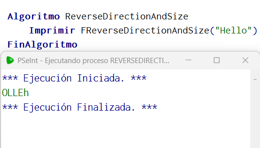

# Statement
---

Create a function called ReverseDirectionAndSize that takes some text as a parameter and reverses it, eg: "Hello" -> "olleH" and also reverses the letters if they are uppercase to lowercase and if they are lowercase to uppercase, it should do something. like this:

"HelLO" --> "olLEh"

"Leonardo" --> "ODRANOEl"

"Text" --> "TXEt"

# Solution
---
### Pseudocode
```python
Funcion result <- toUpperLowerCase (string)
	Definir result Como Caracter;
	SI string = Mayusculas(string) Entonces
		result = Minusculas(string)
	SiNo
		result = Mayusculas(string)
	FinSi
Fin Funcion

Funcion result <- FReverseDirectionAndSize (string)
	Definir result Como Caracter;
	Para count = Longitud(string) Hasta 0 Con Paso -1 Hacer
		letter = Subcadena(string,count,count)
		letter = toUpperLowerCase(letter)
		result = Concatenar(result, letter)
	FinPara
Fin Funcion

Algoritmo ReverseDirectionAndSize
	Imprimir FReverseDirectionAndSize("Hello")
FinAlgoritmo
```

### Result

<br>