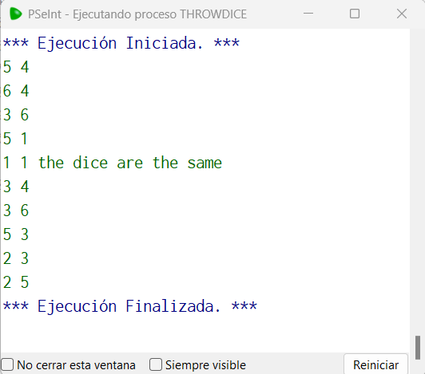

# Statement
---

Make a program that simulates the roll of 2 dice 10 times, and display for each roll the values ​​of the two dice separated by a space, in case the 2 dice throw the same value in addition to the result, add a string to the ending that says "the dice are the same".

# Solution
---
### Pseudocode
```python
Algoritmo throwDice
	Para i = 1 Hasta 10 Con Paso 1 Hacer
		d1 = Aleatorio(1,6)
		d2 = Aleatorio(1,6)
		SI d1 = d2 Entonces
			Imprimir d1, " ", d2, " the dice are the same"
		SiNo
			Imprimir d1, " ", d2
		FinSi
	FinPara
FinAlgoritmo
```

### Result

<br>