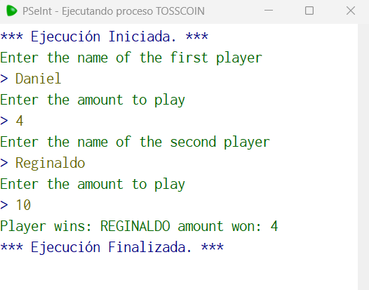

# Statement
---

From the data we receive first a name and a value, then another name and another value, using the built-in function aleatorio() we simulate the flip of a coin, We must return the name of the winner in capital letters and the value I win, to avoid cheating, if a player puts a value of zero or negative, the opponent automatically wins, in case both cheat, "game canceled" is returned.

# Solution
---
### Pseudocode
```python
Algoritmo tossCoin
	Escribir "Enter the name of the first player"
	Leer p1
	Escribir "Enter the amount to play"
	Leer a1
	Escribir "Enter the name of the second player"
	Leer p2
	Escribir "Enter the amount to play"
	Leer a2
	SI a1<=0 | a2 <=0 Entonces
		SI a1<=0 & a2 <=0 Entonces
			Imprimir "Game canceled"
		SiNo
			SI a1<=0 Entonces
				Imprimir "Player wins: ", Mayusculas(p2), " amount won: 0"
			SiNo
				Imprimir "Player wins: ", Mayusculas(p1), " amount won: 0"
			FinSi
		FinSi
	SiNo
		SI Aleatorio(1,2) = 1 Entonces
			Imprimir "Player wins: ", Mayusculas(p1), " amount won: ", a2
		SiNo
			Imprimir "Player wins: ", Mayusculas(p2), " amount won: ", a1
		FinSi
	FinSi
FinAlgoritmo
```

### Result

<br>