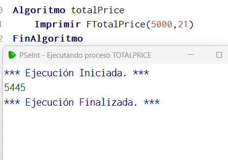

# Statement
---

Create a function called TotalPrice that takes 2 parameters, price and VAT, and returns the price including VAT. if the price exceeds 3000 a 10 percent discount is made on the total price.

# Solution
---
### Pseudocode
```python
Funcion val <- FTotalPrice (price, iva)
	Definir val Como Real;
	SI price > 3000 Entonces
		val = ( price + (price*(iva/100)) ) * 0.90
	SiNo
		val = ( price + (price*(iva/100)))
	FinSi
Fin Funcion

Algoritmo totalPrice
	Imprimir FTotalPrice(5000,21)
FinAlgoritmo
```

### Result

<br>