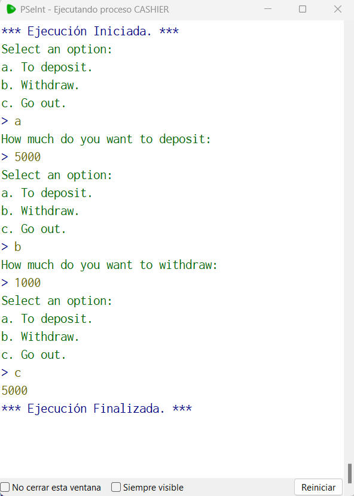

# Statement
---
Create a function called "cashier" that pretends to be a panel of a bank should display the text: "select an option: a. to deposit. b. withdraw. c. go out." and have a value called balance that will return when finished and will print it on the screen, its initial value will be 1000. You must repeat the menu until you select the option 'c'

If we select 'a' it invokes another function called 'deposit' that will display a text on the screen that will say 'how much do you want to deposit:' it will add that value to the balance and end the function.

If we select 'b' it invokes another function called 'withdraw' that will display a text on the screen that will say 'how much do you want to withdraw:' it will subtract that value from the balance and end the function.

"select an option: a. to deposit. b. withdraw. c. go out."

a -->

"how much do you want to deposit:"

500 -->

"select an option: a. to deposit. b. withdraw. c. go out."

b -->

"how much do you want to withdraw:"

1400 -->

"select an option: a. to deposit. b. withdraw. c. go out."

c --> 100

# Solution
---
### Pseudocode
```python
Funcion balance <- cashierF()
	Definir balance Como Real;
	balance = 1000;
	Repetir
		Imprimir "Select an option:";
		Imprimir "a. To deposit.";
		Imprimir "b. Withdraw.";
		Imprimir "c. Go out.";
		leer option
		Si option = 'a' Entonces
			balance = balance + deposit()
		FinSi
		Si option = 'b' Entonces
			balance = balance - withdraw()
		FinSi
	Mientras Que option = "a" | option = "b"
Fin Funcion

Funcion value <- deposit()
	Imprimir "How much do you want to deposit:";
	leer value
FinFuncion

Funcion value <- withdraw()
	Imprimir "How much do you want to withdraw:";
	leer value
FinFuncion

Algoritmo cashier
	Imprimir cashierF()
FinAlgoritmo
```

### Result

<br>