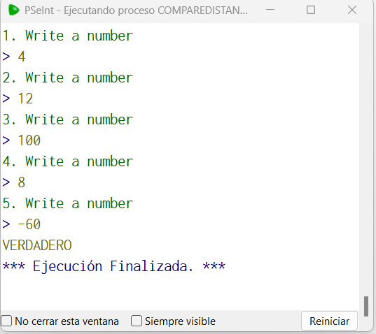

# Statement
---

Create a function called compareDistances that asks for 5 numbers, these can be positive or negative, add the positives with positives and negatives with negatives, the function should return true if there is more distance to 0 with positives or false if the distance is greater with negatives .

4, 12 , 100, 8, -60 --> true

40, 120 , 10, -80, -91 --> false

# Solution
---
### Pseudocode
```python
Funcion result <- compareDistancesF ()
	Definir result Como Logico
	negativeN = 0
	positiveN = 0
	Para i=1 Hasta 5 Con Paso 1 Hacer
		Escribir i, ". Write a number"
		leer n
		SI n > 0 Entonces
			positiveN = positiveN + n
		SiNo
			negativeN = negativeN + n
		FinSi
	FinPara
	result = positiveN > Abs(negativeN)
Fin Funcion

Algoritmo CompareDistances
	Imprimir compareDistancesF()
FinAlgoritmo
```

### Result

<br>