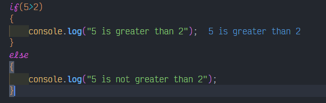

# Statement
---

Create an if statement with the JavaScript syntax

# Solution
---
### Pseudocode
```javascript
if(5>2)
{
    console.log("5 is greater than 2");
}
else
{
    console.log("5 is not greater than 2");
}
```

### Result

<br>