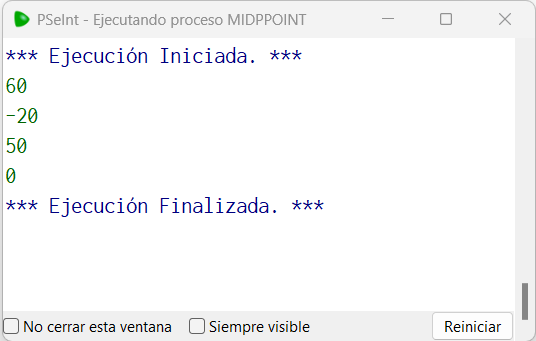

# Statement
---

Write a function called midpoint that given 2 values ​​(can be negative) does not return the value of the midpoint between them

-50,50 --> 0

40, 80 --> 60

# Solution
---
### Pseudocode
```python
Funcion result <- midPointF (n1,n2)
	Definir result Como Real
	result = (n1+n2)/2
Fin Funcion

Algoritmo MidpPoint
	Imprimir midPointF(40,80)
	Imprimir midPointF(40,-80)
	Imprimir midPointF(50,50)
	Imprimir midPointF(-50,50)
FinAlgoritmo
```

### Result

<br>