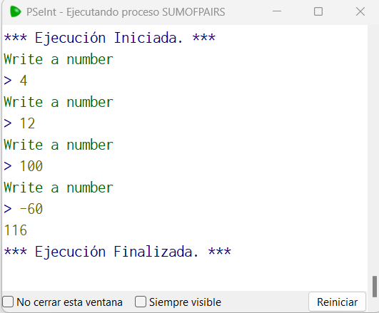

# Statement
---

Write a function called sumOfPairs that asks for a number from 1 to 100 indefinitely, if a negative number or greater than 100 is entered, it stops asking for more numbers and returns the sum of all the even numbers entered.

4, 12 , 100, 11, -60 --> 116

40, 121 --> 40

# Solution
---
### Pseudocode
```python
Funcion result <- sumOfPairsF ()
	Definir result Como Entero
	result = 0
	n = 0
	Repetir
		Si n mod 2 == 0 Entonces
			result = result + n
		FinSi
			
		Escribir 'Write a number'
		Leer n
	Hasta Que n>100 | n<0
Fin Funcion

Algoritmo sumOfPairs
	Imprimir sumOfPairsF()
FinAlgoritmo
```

### Result

<br>