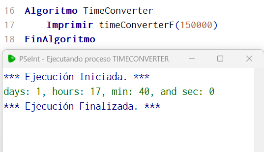

# Statement
---

Create a function called timeConverter that receives a positive number of seconds and returns a string based on the number. "Days: 1, Hours: 5, Minutes: 40 and seconds: 5"

4000 --> "days: 0, hours: 1, minutes: 6, and seconds: 4"

40000 --> "days: 0, hours: 11, minutes: 6, and seconds: 4"

150000 --> "days: 1, hours: 17, minutes: 40, and seconds: 0"

# Solution
---
### Pseudocode
```python
Funcion result <- timeConverterF (n)
	Definir result Como Caracter
	sec = n % 60
	min = Trunc(n/60) % 60
	hours = Trunc(n/3600) % 24
	days = Trunc(n/86400)
	result = Concatenar('days: ', ConvertirATexto(days))
	result = Concatenar(result, ', hours: ')
	result = Concatenar(result, ConvertirATexto(hours))
	result = Concatenar(result, ', min: ')
	result = Concatenar(result, ConvertirATexto(min))
	result = Concatenar(result, ', and sec: ')
	result = Concatenar(result, ConvertirATexto(sec))
Fin Funcion

Algoritmo TimeConverter
	Imprimir timeConverterF(150000)
FinAlgoritmo
```

### Result

<br>