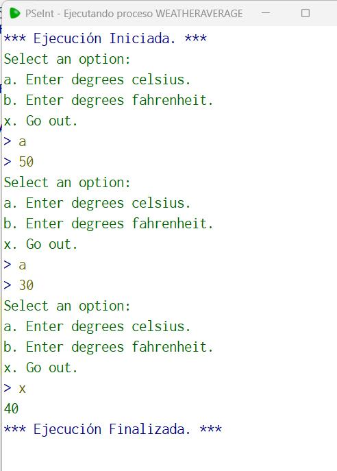

# Statement
---

Write an algorithm that loops indefinitely until 'x' is entered which will calculate an average of the weather, note that for each value entered it should ask if it is fahrenheit or celsius, then ask for the value. add everything up and divide by the number of values ​​entered. The result must be returned in celsius, have a function that, in case fahrenheit is entered, transforms it to celsius in order to add them.

# Solution
---
### Pseudocode
```python
Funcion celsius <- fahrenheitToCelsius (fahrenheit)
	Definir celsius Como Real;
	celsius = (fahrenheit - 32 ) / 1.8
Fin Funcion

Algoritmo WeatherAverage
	cont = 0;
	sum = 0;
	Repetir
		Imprimir "Select an option:";
		Imprimir "a. Enter degrees celsius.";
		Imprimir "b. Enter degrees fahrenheit.";
		Imprimir "x. Go out.";
		leer option
		Si option = "a" | option = "b" Entonces
			leer degree
			cont = cont + 1;
		FinSi
		Si option = 'a' Entonces
			sum = sum + degree;
		FinSi
		Si option = 'b' Entonces
			sum = sum + fahrenheitToCelsius(degree);
		FinSi
	Mientras Que option = "a" | option = "b"
	Imprimir sum / cont;
FinAlgoritmo
```

### Result

<br>