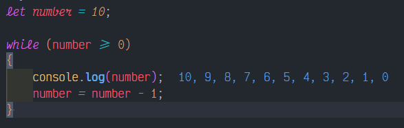

# Statement
---

Create a while loop statement with the JavaScript syntax

# Solution
---
### Pseudocode
```javascript
let number = 10;

while (number >= 0) 
{
    console.log(number);
    number = number - 1;
}
```

### Result

<br>