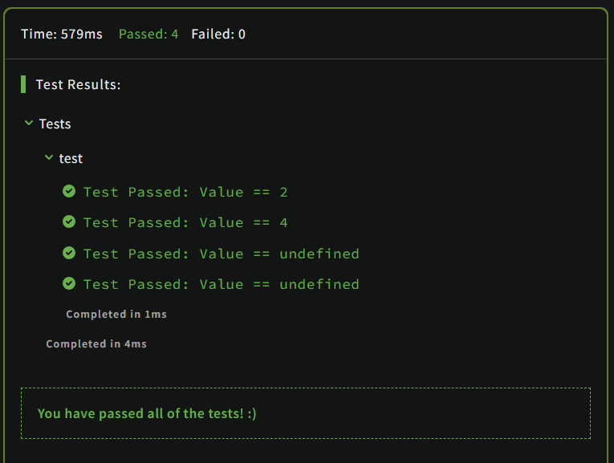

# Extending JavaScript Objects: Get First & Last Array Element

## Description

Your task is to extend JavaScript Array object, with methods `.first()` and `.last()`, so you can get respectively first or last element of the array.

```JavaScript
var a = [2, 5, 7, 3 ,4];

a.first();  // 2
a.last();   // 4

```

## Solution

### Code

```JavaScript
Array.prototype.first = function()
{
  if(this.length == 0)
  {
    return undefined;
  }
  else
  {
    return this[0]
  }
}

Array.prototype.last = function()
{
  if(this.length == 0)
  {
    return undefined;
  }
  else
  {
    return this[this.length-1]
  }
}
```

### Output

<br>