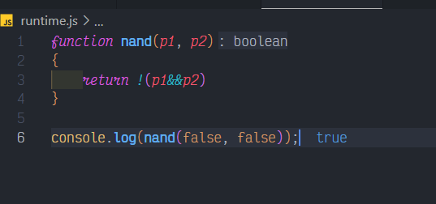

# Boolean

## Description

Write a function nand that takes two Boolean values. If both values are true, the result should be false. In the other cases the return should be true.

I.e.: The call nand(true, true) should return false. The calls nand(true, false), nand(false, true) and nand(false, false) should return true.

## Solution

### Code

This is the code for the problem:

```JavaScript
function nand(p1, p2)
{
    return !(p1&&p2)
}
```

### Output

<br>