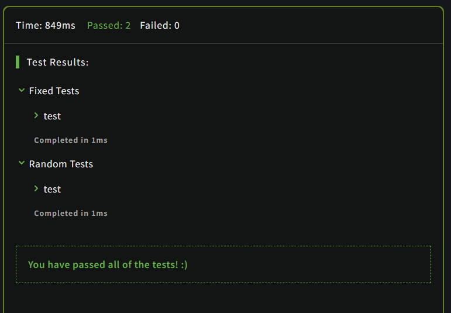

# Count strings in objects

## Description
Create a function strCount (takes an object as argument) that will count all string values inside an object. For example:

```JavaScript
strCount({
  first: "1",
  second: "2",
  third: false,
  fourth: ["anytime",2,3,4],
  fifth:  null
  })
  //returns 3
```

## Solution

### Code

This is the solution for the problem:

```JavaScript
function strCount(obj)
{
    let count = 0;
    for(let aux in obj)
    {
        if(typeof obj[aux] === 'string')
        {
            count++;
        }
        else if(typeof obj[aux] === 'object')
        {
            count+= strCount(obj[aux]);
        }
    }
    return count;
}
```

### Output

<br>