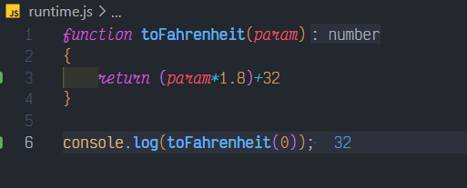

# Fahrenheit

## Description

Write a function toFahrenheit that converts a temperature from Celsius to Fahrenheit.

Example: toFahrenheit(0) should return 32.

## Solution

### Code

This is the code for the problem:

```JavaScript
function toFahrenheit(param)
{
    return (param*1.8)+32
}
```

### Output

<br>