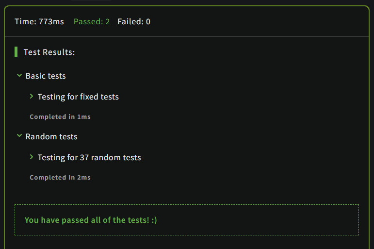

# Convert number to reversed array of digits

## Description

Given a random non-negative number, you have to return the digits of this number within an array in reverse order.

Example(Input=>Output):

```JavaScript
35231 => [1,3,2,5,3]
0 => [0]
```

## Solution

### Code

```JavaScript
function digitize(n) 
{
  let temp = String(n);
  return temp.split('').map(Number).reverse();
}
```

### Output

<br>