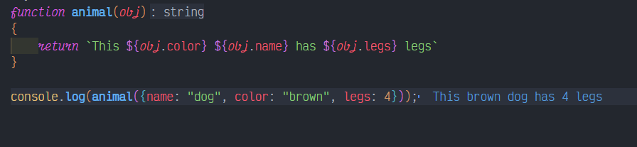

# Objects

## Description

Give you a function `animal`, accept 1 parameter:obj like this:

```JavaScript
{name:"dog",legs:4,color:"white"}
```
and return a string like this:

```JavaScript
"This white dog has 4 legs."
```
When you have finished the work, click "Run Tests" to see if your code is working properly.

In the end, click "Submit" to submit your code pass this kata.

## Solution

### Code

```JavaScript
function animal(obj)
{
    return `This ${obj.color} ${obj.name} has ${obj.legs} legs.`;
}
```

### Output

<br>