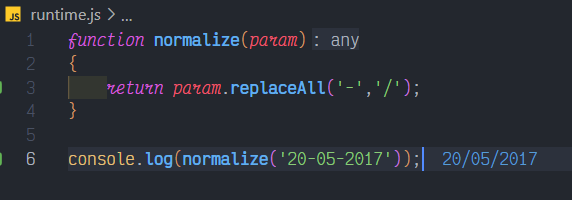

# String: replace()

## Description

Write a function normalize, that replaces '-' with '/' in a date string.

Example: normalize('20-05-2017') should return '20/05/2017'.

## Solution

### Code

This is the code for the problem:

```JavaScript
function normalize(param)
{
    return param.replaceAll('-','/');
}
```

### Output

<br>