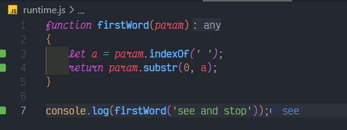

# String: substr()

## Description

Write a function firstWord, taking a string and returning the first word in that string. The first word are all characters up to the first space.

Example: firstWord('see and stop') should return 'see'.

## Solution

### Code

This is the code for the problem:

```JavaScript
function firstWord(param)
{
    let a = param.indexOf(' ');
    return param.substr(0, a);
}
```

### Output

<br>