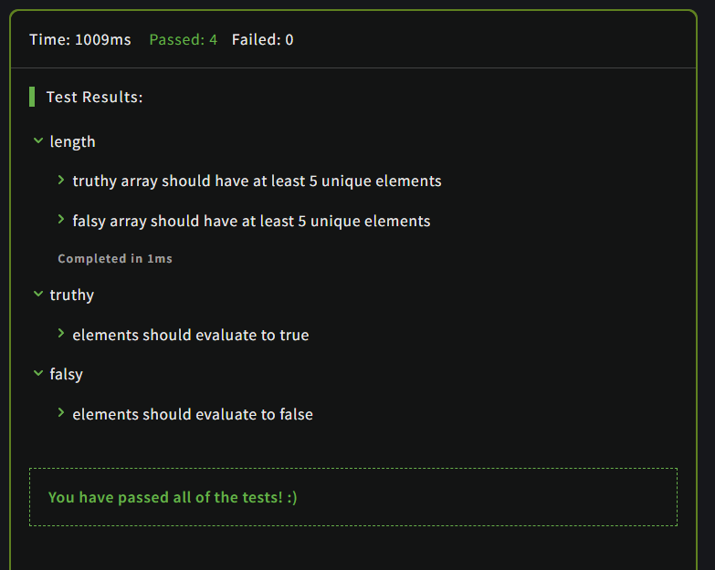

# Truthy and Falsy

## Description

In JavaScript there are truthy and falsy values:

- truthy: a value that when evaluated in a boolean context returns true
- falsy: a value that when evaluated in a boolean context returns false

You are given two empty arrays (truthy and falsy) and you have to fill this array with at least 5 elements in each which will evaluate to true or false accordingly.

MDN links:

- https://developer.mozilla.org/en/docs/Glossary/Truthy
- https://developer.mozilla.org/en-US/docs/Glossary/Falsy

## Solution

### Code

```JavaScript
const truthy = [true, 1, [], 'hola', Infinity];
const falsy = [null, undefined, 0, false, ''];
```

### Output

<br>