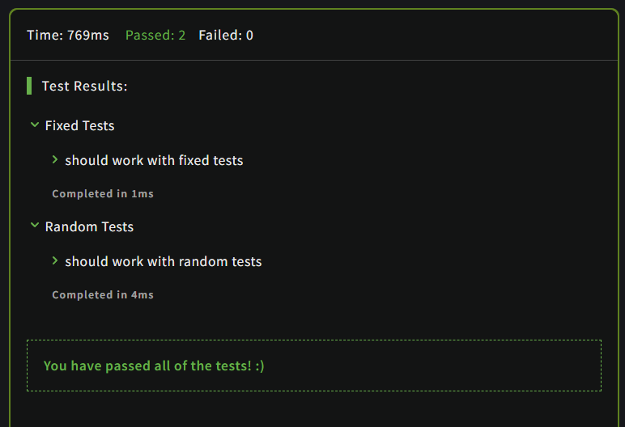

# Encrypt this!

## Description

Encrypt this!

You want to create secret messages which can be deciphered by the Decipher this! kata. Here are the conditions:

1. Your message is a string containing space separated words.
2. You need to encrypt each word in the message using the following rules:
   - The first letter must be converted to its ASCII code.
   - The second letter must be switched with the last letter
3. Keepin' it simple: There are no special characters in the input.
Examples:

## Solution

```JavaScript
encryptThis("Hello") === "72olle"
encryptThis("good") === "103doo"
encryptThis("hello world") === "104olle 119drlo"
```

### Code

```JavaScript
function firstEncript(item, index, array)
{
  let aux = item[0].charCodeAt();
  let res = item.slice(1, item.length);
  array[index] = aux+res;
}

function secondEncript(item, index, array)
{
  if(item.length > 2){
    let secondLetter = item[1];
    let lastLetter = item[item.length-1];
    let aux = item.slice(0, 1) + lastLetter + item.slice(2, item.length-1) + secondLetter;
    array[index] = aux;
  }
}

var encryptThis = function(text) {
  // Implement me! :)
  text = text.split(" ");
  text.forEach(secondEncript);
  text.forEach(firstEncript);
  return text.join(" ");
}
```

### Output

<br>