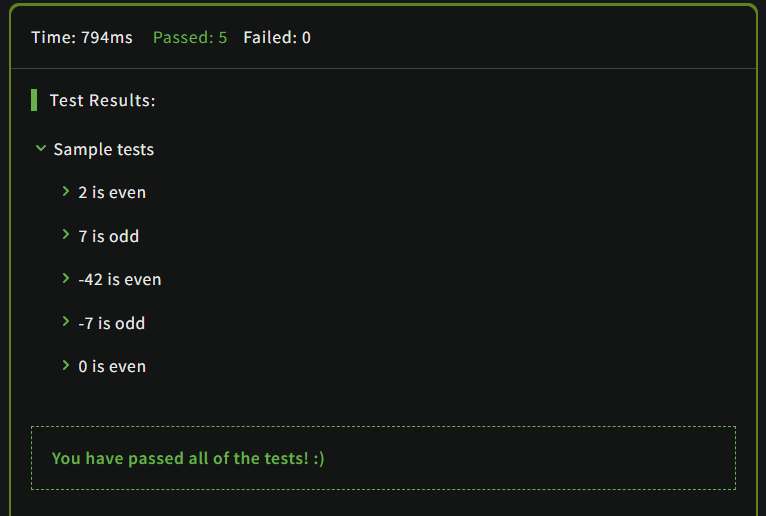

# Even or Odd

## Description

Create a function that takes an integer as an argument and returns `"Even"` for even numbers or `"Odd"` for odd numbers.

## Solution

### Code

```JavaScript
function evenOrOdd(number) 
{
    return number%2===0 ? "Even" : "Odd"
}
```

### Output

<br>