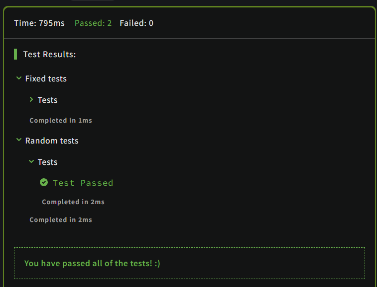

# A wolf in sheep's clothing

## Description

Wolves have been reintroduced to Great Britain. You are a sheep farmer, and are now plagued by wolves which pretend to be sheep. Fortunately, you are good at spotting them.

Warn the sheep in front of the wolf that it is about to be eaten. Remember that you are standing at the front of the queue which is at the end of the array:

```Javascript
[sheep, sheep, sheep, sheep, sheep, wolf, sheep, sheep]      (YOU ARE HERE AT THE FRONT OF THE QUEUE)
   7      6      5      4      3            2      1
```

If the wolf is the closest animal to you, return "Pls go away and stop eating my sheep". Otherwise, return "Oi! Sheep number N! You are about to be eaten by a wolf!" where N is the sheep's position in the queue.

Note: there will always be exactly one wolf in the array.

## Solution

### Code

```JavaScript
function warnTheSheep(queue) {
  if(queue[queue.length-1] === 'wolf')
  {
    return "Pls go away and stop eating my sheep";
  }
  else
  {
    let temp = queue.reverse();
    for(let i in temp)
    {
      if(temp[i]==='wolf')
        return `Oi! Sheep number ${i}! You are about to be eaten by a wolf!`;
    }
  }
}
```

### Output

<br>