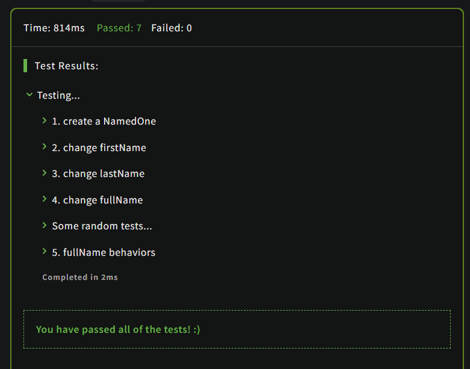

# "this" is an other problem

## Description

Having created a function NamedOne which takes first & last names as parameters and returns an object with firstName, lastName and fullName ( = firstName + a space + lastName ) properties which should be all accessibles, we discovered that "accessible" also means "mutable".

If, for example, we've got a "NamedOne" like this :

```JavaScript
var namedOne = new NamedOne("Naomi","Wang")
namedOne.firstName // -> "Naomi"
namedOne.lastName  // -> "Wang"
namedOne.fullName  // -> "Naomi Wang"
```

...properties may be changed :

```JavaScript
namedOne.firstName = "John"
namedOne.firstName // -> "John"
namedOne.lastName = "Doe"
namedOne.lastName  // -> "Doe"
```

...but all properties are not updated !

```JavaScript
namedOne.fullName  // -> "Naomi Wang" 
//-- Oh no ! we want fullName == "John Doe" now !
```

### Your mission:

So the purpose of this kata is to create an object with accessible and "updatable" (can i say that?) properties.

- If .firstName or .lastName are changed, then .fullName should also be changed
  
- If .fullName is changed, then .firstName and .lastName should also be changed.
  
**Note :** "input format" to .fullName will be firstName + space+ lastName. If given fullName isn't valid then no property is changed.
## Solution

### Code

```JavaScript
function NamedOne(first, last){
    this.firstName = first;
    this.lastName = last;
}

NamedOne.prototype = {
  get fullName(){
    return this.firstName+' '+this.lastName;
  },
  set fullName(fn){
    var name = fn.split(' ');
    if(2 == name.length){
      this.firstName = name[0];
      this.lastName  = name[1];
    }
  }
}
```

### Output

<br>