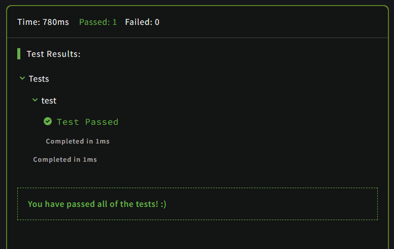

# Convert string to camel case

## Description

Complete the method/function so that it converts dash/underscore delimited words into camel casing. The first word within the output should be capitalized only if the original word was capitalized (known as Upper Camel Case, also often referred to as Pascal case). The next words should be always capitalized.

### Examples

```JavaScript
"the-stealth-warrior" gets converted to "theStealthWarrior"
"The_Stealth_Warrior" gets converted to "TheStealthWarrior"
```

## Solution

### Code

```JavaScript
function toCamelCase(str){
  let temp = str.split(/[-_]/);
  
  temp.forEach((item, index) => {
    if(index === 0) return;
    temp[index] = item.charAt(0).toUpperCase() + item.slice(1);
  });

  return temp.join("")
}
```

### Output

<br>