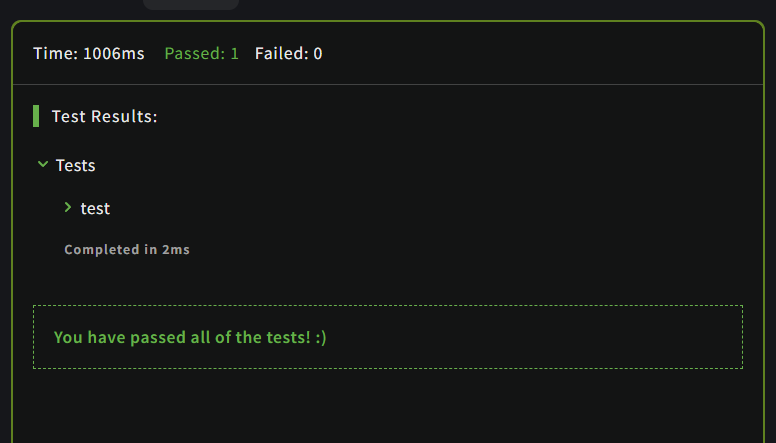

# The Hashtag Generator

## Description

Here's the deal:

- It must start with a hashtag (#).
- All words must have their first letter capitalized.
- If the final result is longer than 140 chars it must return false.
- If the input or the result is an empty string it must return false.

###Examples

```JavaScript
" Hello there thanks for trying my Kata"  =>  "#HelloThereThanksForTryingMyKata"
"    Hello     World   "                  =>  "#HelloWorld"
""                                        =>  false
```

## Solution

### Code

```JavaScript
function generateHashtag (str) {
  if (str === "") return false;
  let x = str.split(' ').filter((word) => word !== '').map((word) => word.charAt(0).toUpperCase() + word.slice(1)).join('');
  if( x.length > 139) return false
  if( x === "") return false
  return "#".concat(x);
}
```

### Output

<br>