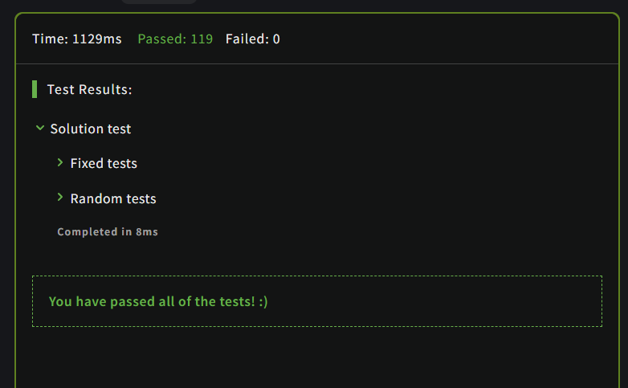

# Valid Parentheses

## Description

Write a function that takes a string of parentheses, and determines if the order of the parentheses is valid. The function should return true if the string is valid, and false if it's invalid.

### Examples

```JavaScript
"()"              =>  true
")(()))"          =>  false
"("               =>  false
"(())((()())())"  =>  true
```

## Solution

### Code

```JavaScript
function validParentheses(parens) {
  let count = 0;
  for(let i of parens) 
  {
    if(i === '(') count++;
    if(i === ')') count--;
    if (count < 0) return false;
  }
  return count === 0;
}
```

### Output

<br>