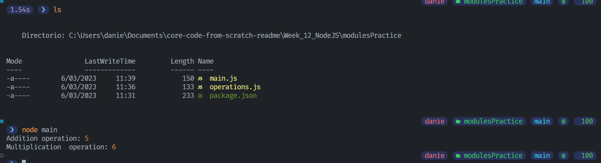

# Node.JS Hello World - Practice

## Description
Time to put into practice what you learned about Node.JS modules 😁.

1. Create a new Node.JS project, name it: `<your-nickname>/modules`
2. Create a new module, name it: `operations.js`
3. Inside `operations.js` implement two functions, one for the sum operation
   and one for the subtract operation.
4. Create a new module, name it: `main.js`
5. Import the functions implemented in `operations.js` and use them in any
   way in `main.js`.


## Solution
- [`Files`](./modulesPractice)


### main.js

```JavaScript
const { sum, mul } = require("./operations");

console.log("Addition operation:", sum(2, 3));
console.log("Multiplication  operation:", mul(2, 3));
```

### operations.js

```JavaScript
function sum(n1, n2)
{
    return n1 + n2;
}

function mul(n1, n2) 
{
    return n1 * n2;
}

module.exports = { sum, mul };
```

### package.json

```json
{
  "name": "danieldubon",
  "version": "1.0.0",
  "description": "practice modules",
  "main": "main.js",
  "scripts": {
    "test": "echo \"Error: no test specified\" && exit 1"
  },
  "author": "DanielDubon",
  "license": "MIT"
}

```

## Images

<br>