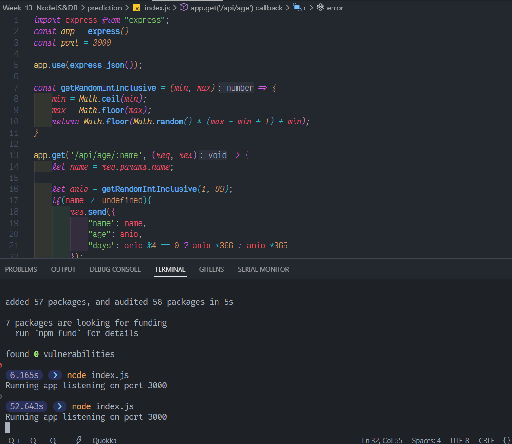
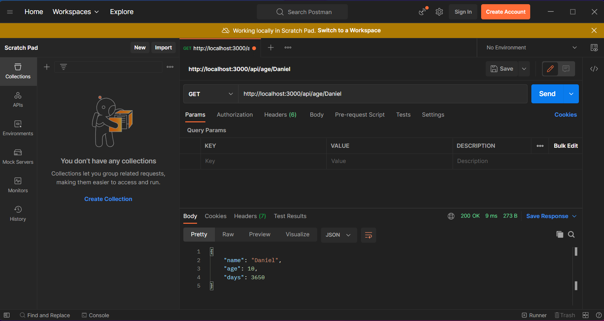
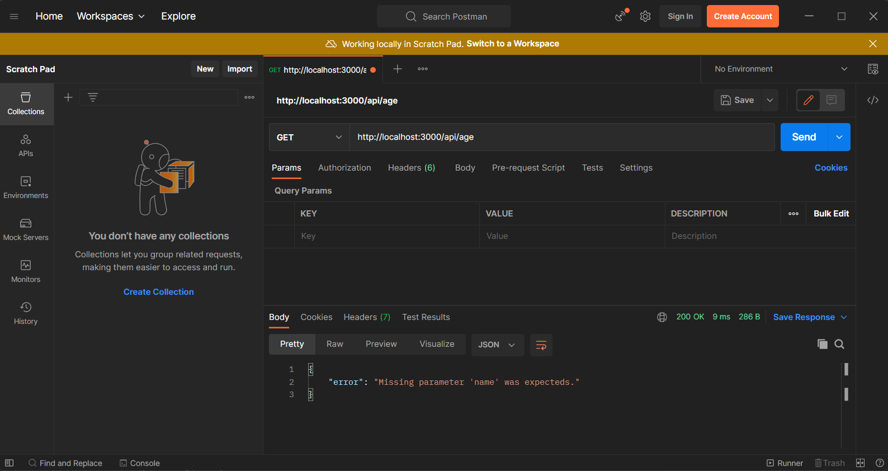

# APIs Core Understanding

## Description

- Use Express.JS to build the API.
- The API should be capable to response to any name.
- The API should use route parameters to get the name:

```bash
    # Request example
    # Here samsepiol is the name the API should try to
    # predict the age.
    http://localhost:3000/api/age/samsepiol
```

- The age should be a random number that satisfies the condition: `age > 0 && age < 100`
- The response should include the age in days.
- The response should look similar to this one:

```json
{
  "name": "samsepiol",
  "age": "62",
  "days": "19366"
}
```

- If no name is provided in the request, the API should return an error message  
  prompting you to use the correct parameters:

  ```json
  {
    "error": "Missing parameter 'name' was expected."
  }
  ```

## Solution

- [`Files 💻`](./prediction)

### Code

***index.js***

```JavaScript
import express from "express";
const app = express()
const port = 3000

app.use(express.json());

const getRandomIntInclusive = (min, max) => {
    min = Math.ceil(min);
    max = Math.floor(max);
    return Math.floor(Math.random() * (max - min + 1) + min);
}

app.get('/api/age/:name', (req, res) => {
    let name = req.params.name;

    let anio = getRandomIntInclusive(1, 99);
    if(name != undefined){
        res.send({
            "name": name,
            "age": anio,
            "days": anio %4 == 0 ? anio *366 : anio *365
        });
    }else{
        res.send({
            "error": "Missing parameter 'name' was expected."
        });
    }
})

app.get('/api/age', (req, res) => {
    let r = {
        error: "Missing parameter 'name' was expecteds."
    }

    res.json(r);
})

app.listen(port, () => {
  console.log(`Running app listening on port ${port}`)
})
```

***package.json***

```json
{
  "name": "prediction",
  "version": "1.0.0",
  "description": "",
  "main": "index.js",
  "type": "module",
  "scripts": {
    "test": "echo \"Error: no test specified\" && exit 1"
  },
  "keywords": [],
  "author": "",
  "license": "ISC",
  "dependencies": {
    "express": "^4.18.2"
  }
}
```

### Output

<br>

<br>

<br>